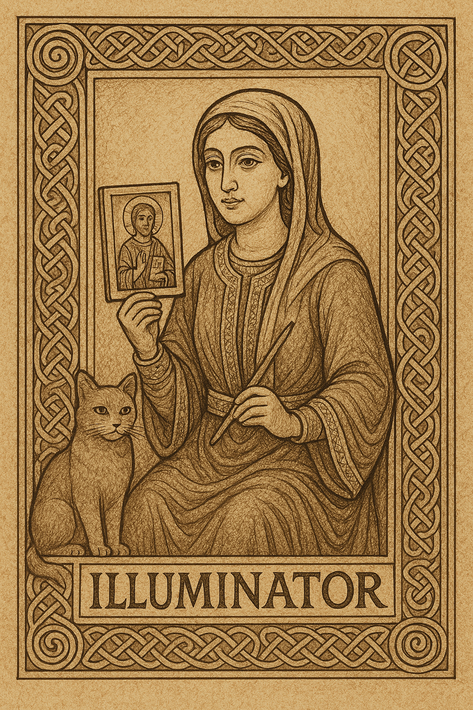

# Character Sheet – Illuminator  

✠ Artist, scribe, visionary. Companion: Cat.  
✠ Called to preserve memory, bring light through art, and soften hearts with sacred images.  

---

## Name and Origins  
- Pilgrim’s Name:  
- Homeland / Tradition:  
- Story of Exile:  

---

## Virtues  
✠ Begin with 1 in each; may rise or fall as Providence allows.  
- Faith: ____  
- Hope: ____  
- Charity: ____  

---

## Abilities  

- **Living Art (Hope)** – Inspire allies with holy vision or frighten a foe; grant +1 Hope to all allies this round *or* remove 1 Step from an enemy.  
- **Scriptural Rebuke (Faith)** – Speak sacred words; banish 1 Step from a supernatural foe or attempt Conversion against a human.  
- **Art of Peace (Charity)** – Display sacred images; reduce Social Measure by 2 or attempt Conversion.  
- **Illuminated Record (Faith)** – Chronicle the mission; one ally regains +1 Hope, and the party gains a lasting memory. Later, gain +2 to a closely related test.  

✠ *Write notes when art or word shapes the scene, that memory may be kept bright.*  

---

## Companion – Cat  

- **Distracting Claws (combat):** One enemy loses 1 action, once per scene.  
- **Silent Observer (non-combat):** Auto-succeed at uncovering hidden things, whether motives, traps, or secrets.  

✠ The Cat is quiet watcher and sudden protector, herald of hidden truth.  

---

## Wounds  

[ ] [ ] [ ]  
✠ At 3 Wounds, the Illuminator is unable to act until healed by Rest, Reward, Intercession, or aid.  

---

## Inventory Slots – 7  

-  
-  
-  
-  
-  
-  
-  

✠ Record ink, parchment, relics, or supplies here. Each unit fills 1 slot.  

---

## Notes & Memories  

✠ Record visions, illuminations, and chronicles made by hand and heart.  
-  
-  
-  

---

  

✠ *“By ink and light, I guard memory and vision.”*  
