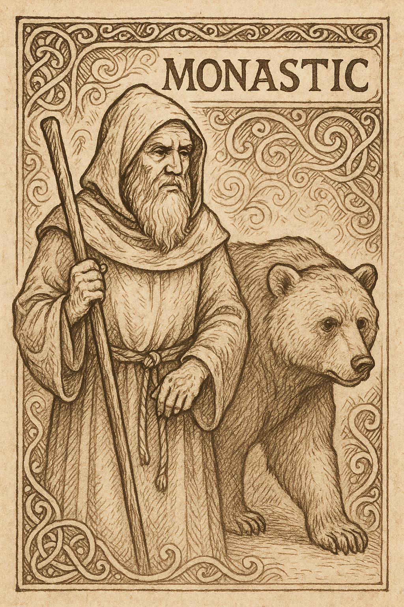

# Character Sheet – Monastic  

✠ Healer, builder, reconciler. Companion: Bear.  
✠ Called to mend wounds of flesh and of stone, and to speak peace where strife divides.  

---

## Name and Origins  
- Pilgrim’s Name:  
- Homeland / Monastery:  
- Story of Exile:  

---

## Virtues  
✠ Begin with 1 in each; may rise or fall as Providence allows.  
- Faith: ____  
- Hope: ____  
- Charity: ____  

---

## Abilities  

- **Staff Strike (Faith)** – A measured blow; remove 1 Step.  
- **Healing Hands (Charity)** – Heal 1 Wound; if ally was at 0, also restore 1 Hope.  
- **Mender of Walls (Faith)** – Complete 1 step of building or repair instantly.  
- **Voice of Peace (Hope)** – Reconcile hearts; attempt Conversion with –2 Measure.  

✠ *Record moments when each gift is used, for the edification of the fellowship.*  

---

## Companion – Bear  

- **Bear’s Charge (combat):** Remove one enemy from the scene entirely, once per mission.  
- **Beast of Burden (non-combat):** Add +3 inventory slots to the party while the Bear travels with them.  

✠ The Bear is a strength both gentle and fierce, carrying the weight of many.  

---

## Wounds  

[ ] [ ] [ ]  
✠ At 3 Wounds, the pilgrim is unable to act until healed by Rest, Reward, Intercession, or aid.  

---

## Inventory Slots – 9 (+3 with Bear)  

-  
-  
-  
-  
-  
-  
-  
-  
-  
-  
-  
-  

✠ Write down supplies, relics, or materials here. Each unit fills 1 slot.  

---

## Notes & Memories  

✠ Record prayers, reconciliations, and labors of building.  
-  
-  
-  

---

  

✠ *“By staff and stone, I heal and build.”*  
